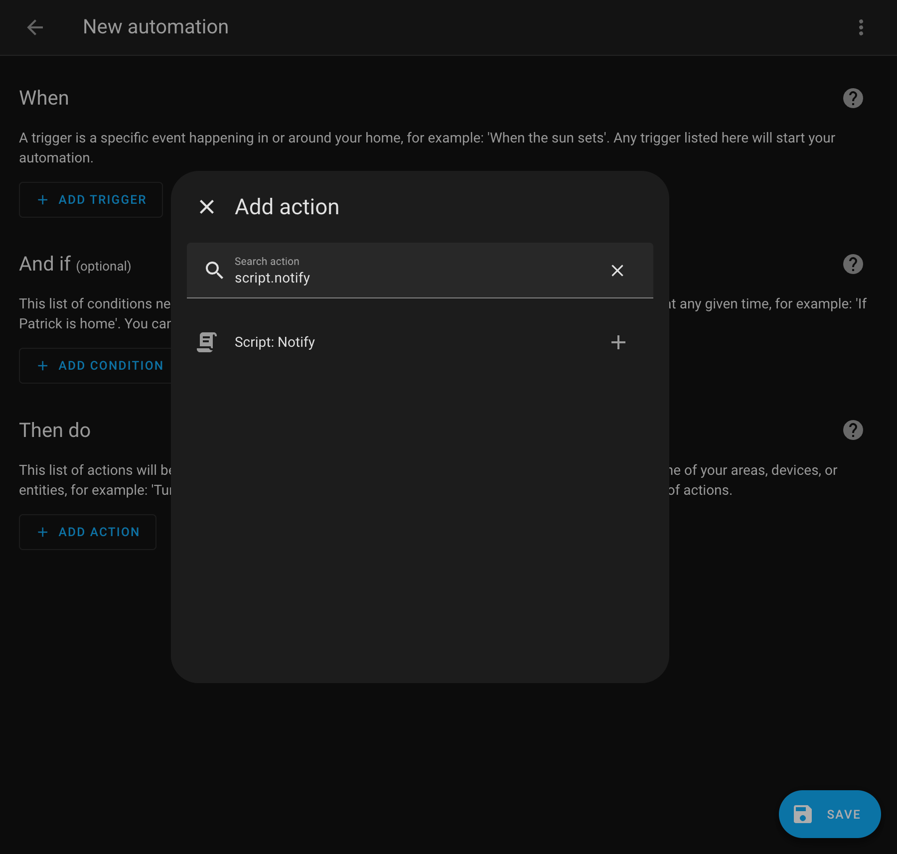
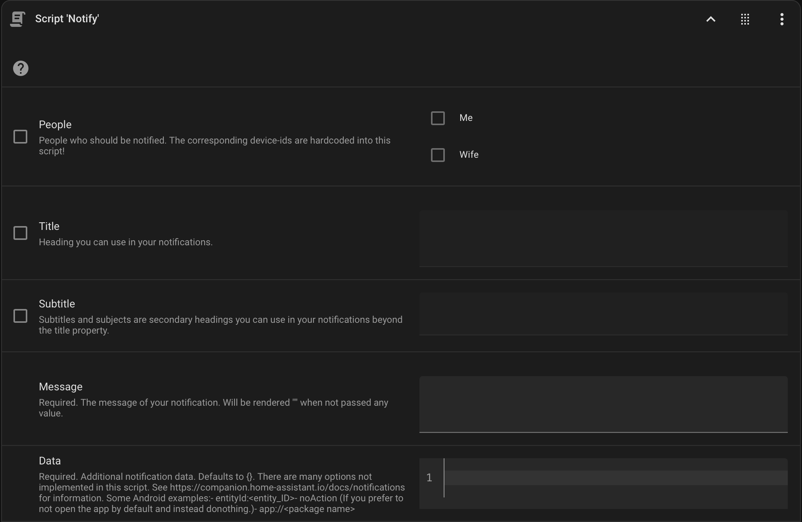
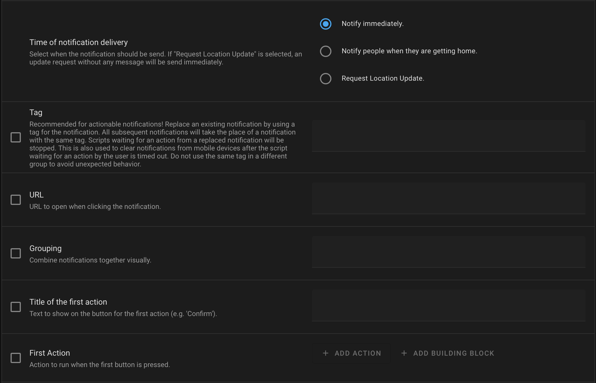
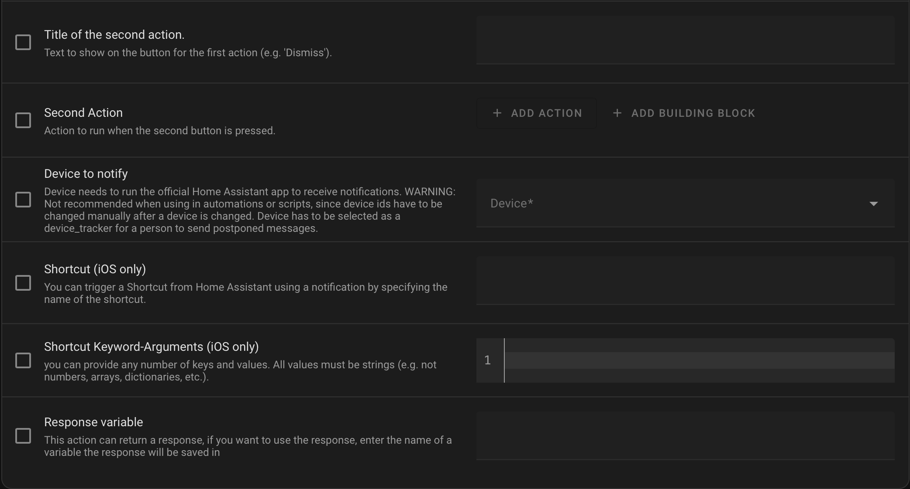

# homeassistant-pending-notifications
Home Assistant scripts and automations to postpone mobile phone notifications and deliver them when the recipient returns home. Also create advanced (e.g. actionable) notifications within the visual editor.

## Features
- [x] Works with personalized notifications. For broadcasting style notifications (recipient is not predetermined but selected based on their location) something like [iq_notify](https://github.com/cadavre/iq_notify) might be a better solution.
- [x] Change device information at only one location when people in your home change devices.
- [ ] Create mobile app notifications in scripts and automations using the visual editor (without yaml):
  - [x] Basic notifications with `title`, `message` and `data`.
  - [x] [Actionable notifications](https://companion.home-assistant.io/docs/notifications/actionable-notifications):
    - [x] With two customizable actions and up to two automatic postponement options.
    - [x] Allow parallel notifications without [blocking behavior](https://companion.home-assistant.io/docs/notifications/actionable-notifications#blocking-behaviour).
    - [x] Time out script instances waiting for user interaction.
    - [x] Clear notifications after corresponding scipt instance timed out.
    - [x] Stop waiting script instances when notification is replaced.
    - [ ] [uri values](https://companion.home-assistant.io/docs/notifications/actionable-notifications#uri-values).
    - [ ] [iOS specific options](https://companion.home-assistant.io/docs/notifications/actionable-notifications#ios-specific-options).
  - [ ] [Attatchments](https://companion.home-assistant.io/docs/notifications/notification-attachments).
  - [x] [Clearing](https://companion.home-assistant.io/docs/notifications/notifications-basic#clearing).
    - [ ] [Android specific Notification Cleared](https://companion.home-assistant.io/docs/notifications/notification-cleared).
  - [ ] [Critical Notifications](https://companion.home-assistant.io/docs/notifications/critical-notifications).
  - [ ] [Notification Commands](https://companion.home-assistant.io/docs/notifications/notification-commands):
    - [x] request_location_update
    - [x] clear_notification
    - [ ] iOS specific Notification Commands.
    - [ ] Android specific Notification Commands.
  - [x] [Grouping](https://companion.home-assistant.io/docs/notifications/notifications-basic#grouping).
  - [x] [Opening a URL](https://companion.home-assistant.io/docs/notifications/notifications-basic#opening-a-url).
    - [ ] [Android specific uri values](https://companion.home-assistant.io/docs/notifications/actionable-notifications#blocking-behaviour).
  - [x] [Replacing](https://companion.home-assistant.io/docs/notifications/notifications-basic#replacing).
  - [ ] [Sounds](https://companion.home-assistant.io/docs/notifications/notification-sounds).
  - [x] [Subtitle/ Subject](https://companion.home-assistant.io/docs/notifications/notifications-basic#subtitle--subject).
- [x] Automatically add `Remind me at home` button to notifications delivered when recipient is not home (❗not fully tested).
- [x] Automatically add `Remind me later` and `Remind me tomorrow` button to notifications delivered when recipient is home (❗not fully tested).
- [x] Queue postponed notifications for later delivery.
- [x] Deliver queued notifications when recipient returns home.
- [x] Deliver notifications after user queued them for later delivery.

## How to use
- Add an action to a automation or script and select the notify script.

- Configure your notification using the visual editor.

## How to get it working
- Add the template sensor from [sensor_pending_notifications_when_away.yaml](sensor_pending_notifications_when_away.yaml) to your `configurations.yaml`.
- Create a scipt with the content of [script_parallel_notification_helper.yaml](script_parallel_notification_helper.yaml)
- Create a scipt with the content of [script_notify.yaml](script_notify.yaml). Make sure to change:
  - `fields`:`people`:`options` add the names of your users here.
  - Add the `device_id`s, names and device OS for those users to: `sequence`:`[1]`:`variables`:`users`
- Create an automation with the content of [automation_notify_people_when_they_are_getting_home.yaml](automation_notify_people_when_they_are_getting_home.yaml).
  - Make sure to change the triggers to represent your home:
    - The automation should trigger when people come home.
    - The automation should trigger regularly so notifications postponed by the user with the `Remind me later` button are delivered.
    - I added an `input_button` helper to clear pending notifications in case something goes wrong. This is not needed since the action could be triggered from the automation editor or development tools too.
  - Make sure to change the conditions for the second choose to represent your home:
    - `{{ (as_timestamp(now()) - as_timestamp(state_attr("automation_notify_people_when_they_are_getting_home","last_triggered"))) | int(0) > 600 }}` makes sure the automation does not run when it was triggered within 5 minutes prior.
    - The second condition avoids automation runs when there are no pending notifications. Duh...
    - All the other conditions are specific to my home. If you don't have similar entities you can simply delete those conditions:
      - I use the custom template sensor `binary_sensor.home_jemand_zuhause` as condition to any automation that should only run when someone is home.
      - `input_boolean.home_state_gast_modus` is a helper so the `binary_sensor.home_jemand_zuhause` can set to `home` manually in case guests are staying at the house (without my wifes or mine phone present) and stuff like heating has to work.
      - `input_boolean.home_state_schlafen` and `input_boolean.home_state_nsdr` will be set automatically when someone is sleeping so shades and stuff don't move unexpectedly

## TODOs:
- [ ] Add option for automatic actions `Remind me later`, `Remind me tomorrow` and `Remind me at home` instead of always adding them.
- [ ] Implement Android specific Notification Cleared.
- [ ] Add URL-Selector for lovelace pages.

## Credits
This project was inspired by [Simon42](https://www.simon42.com/home-assistant-zu-hause-benachrichtigen/). The scripts and ideas are heavily based on [Pending / Postponed notifications](https://community.home-assistant.io/t/pending-postponed-notifications/363234) by [RoboMagus](https://gist.github.com/RoboMagus/).

Thank you to the Home Assistant Developers and Community! ❤️